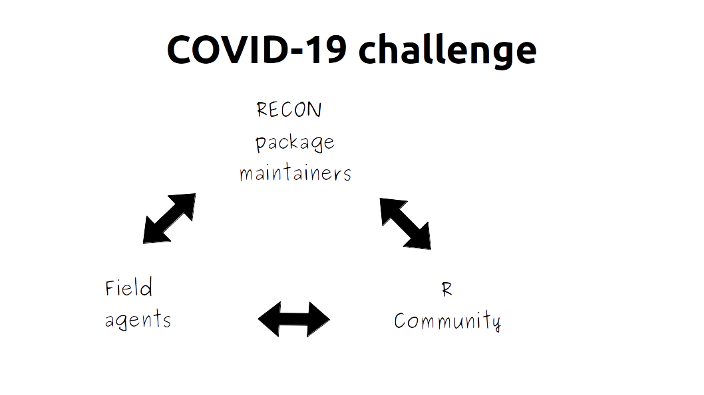
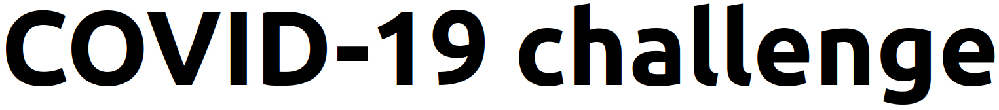

```{r setup, include=FALSE}
knitr::opts_chunk$set(echo = TRUE)
```

# About

R Epidemics Consortium's ([RECON](www.repidemicsconsortium.org)) **COVID-19 challenge** is a communication platform between field epidemiologists, infectious disease modellers and R developers whose goal is to help field agents who are dealing with the response to COVID-19 to fill their analytical needs. It provides a direct and real-time communication channel between the field and the R community focused on the development of R tools used to deal with epidemic outbreaks and COVID-19.

{ width=60% }

Possible development requests include modification of existing functions, creation of new packages or requests for analysis templates. A full list can be found [here](LINK TO LEARN PAGE, at the level of the tasks description).

The platform provides a [simple template request form](LINK TO CREATE TASK) for field agents to submit their needs and a [list of tasks ranked by order of importance](LINK TO EXPLORE PAGE) for volunteer members of the R community to identify the most pressing needs. It also helps package developers  focus their next updates. You can learn how to use the platform [here](LEARN PAGE).

Packages who collaborate with the platform mainly include the [suite of RECON packages](https://www.repidemicsconsortium.org/projects/) but also CITE. Please contact us at repidemicsconsortium@gmail.com if you believe your package falls in the scope of the platform.

This project was financed by the [R consortium](www.r-consortium.org/). (ELABORATE?)

# Learn

<!-- See [lifecycle](https://docs.google.com/document/d/1nJ-3z9_Sjt1H5QObYqcCJwlX12t9PWyj6JVMF-_GljE/edit#heading=h.4l7j2el395j0) and do simple visualisation.

Maybe overall visualisation and/or visualisation from the point of view of the issuer and assignee.

Once flow is complete. Here add what is a task and not. Here add the task lifecycle. Divide in user side/R volunteer side. -->

Waiting for site to have full functionality.

# Home

logo: { width=20% }

Be part of the global response to COVID-19.

Join a community of field epidemiologists, infectious disease modellers and R programmers and contribute to improve the free and open source R tools used in the response to the COVID-19 epidemic.

ADD AS BUTTON: [You are a COVID-19 response field agent and want to submit a request](link to “create a task” page)  
ADD AS BUTTON: [You are a member of the R community and wish to contribute to the response to COVID-19](link to “explore tasks” page)

Tools developed by the R epidemics consortium (RECON) are essential in helping professionals design outbreak analytics pipelines in response to COVID-19.

Your R programming skills can help field agents fight against COVID-19 around the world.

RECON packages have been used in many outbreaks such as the Ebola outbreaks in West Africa (2014-2016) and Eastern Democratic Republic of the Congo (2018-2020), and are currently used by various public health institutions and academic modelling groups in the COVID-19 response.

Add contacts, links to social media, etc
